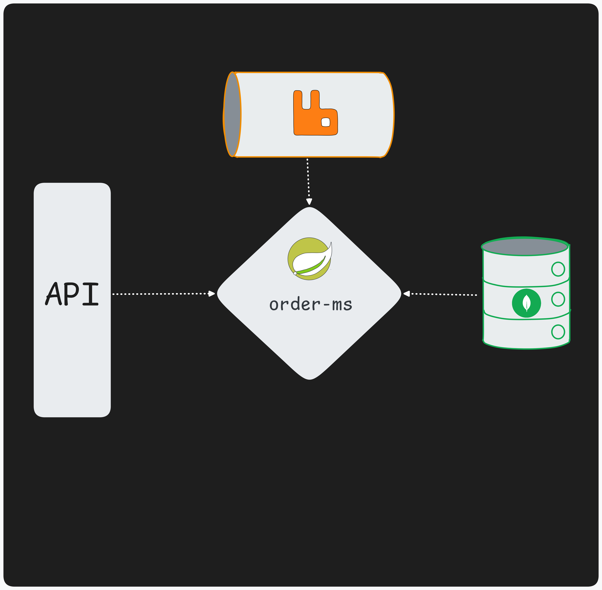

Challenge description [CHALL.md](CHALL.md)

Stack:
   - Java 21
   - Spring Boot 3.5.11
   - MongoDB
   - RabbitMQ
   - Docker

<br><br><br>

How to Run:

Clone this repo:
```bash
git clone --filter=blob:none --no-checkout https://github.com/ppp16bit/challs
cd challs
git sparse-checkout init --cone
git sparse-checkout set java/BtgPactual
git checkout
```
Configure the env variables

```bash
cat .env.template > .env 
```
Modify these variables
```bash
# DATABASE USED BY APPLICATION
MONGO_DATABASE=
# ROOT USER (created by Docker)
MONGO_INITDB_ROOT_USERNAME=
MONGO_INITDB_ROOT_PASSWORD=
```

Make sure **Docker** is installed and running on your machine, then run:

```bash
docker compose up --build -d
```
 - This will pull the images from Docker Hub and start the containers
 - Docker image available on [Docker Hub](https://hub.docker.com/r/pppedro/btg-pactual-chall)
<br><br>

For MongoDB, i suggest running **mongosh** inside the mongo container
<br>

 - **Modify the fields that contain <>**
```bash
docker exec -it btgpactual-mongodb-1 mongosh -u <your_root_username> -p <your_root_password> --authenticationDatabase admin
```
<br>

Search for this in your browser to open the **RabbitMQ Management** interface:

```bash
http://localhost:15672/
```
 - Username: guest
 - Password: guest\
<br>


How to test with **RabbitMQ Management and Curl**

Publish a message for the **btg.pactual-order-created** queue using the JSON below

```json
   {
       "OrderCode": 1001,
       "ClientCode":1,
       "items": [
           {
               "product": "pencil",
               "quantity": 100,
               "price": 1.10
           },
           {
               "product": "notebook",
               "quantity": 10,
               "price": 1.00
           }
       ]
   }
```

Execute this curl request in your terminal

```bash
curl -X GET "http://localhost:8080/customers/1/orders?page=0&pageSize=10" -H "Content-Type: application/json"
```

Expected result :>
```bash
{"summary":{"totalOnOrders":120.00},"data":[{"orderID":1001,"customerID":1,"total":120.00}],"pagiantion":{"page":0,"pageSize":10,"totalElements":1,"totalPages":1}}%
```