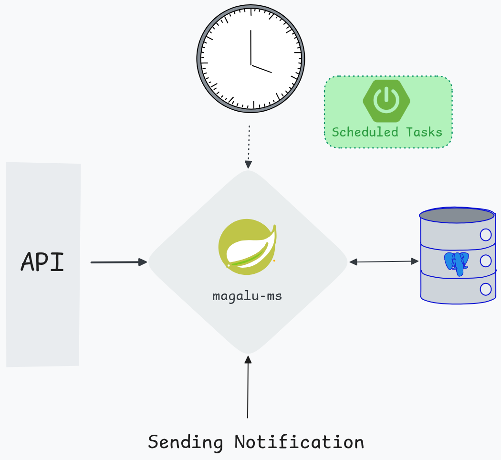

Challenge description [CHALL.md](CHALL.md)

Stack:
 - Java 21
 - Spring Boot 3.5.11
 - PostgreSQL 16
 - Docker

<br><br><br>

How to run:

Clone this repo:

```bash
git clone --filter=blob:none --no-checkout https://github.com/ppp16bit/challs
cd challs
git sparse-checkout init --cone
git sparse-checkout set java/Magalu
git checkout
```

Configure the env variables

```bash
cat .env.template > .env
```

Modify these variables

```bash
POSTGRES_USER=
POSTGRES_PASSWORD=
```

Make sure **Docker** is installed and running on your machine, then run:

```bash
docker compose up --build -d
```
 - This will pull the images from Docker Hub and start the containers
 - Docker image available on [Docker Hub](https://hub.docker.com/r/pppedro/magalu-chall)
<br><br>


